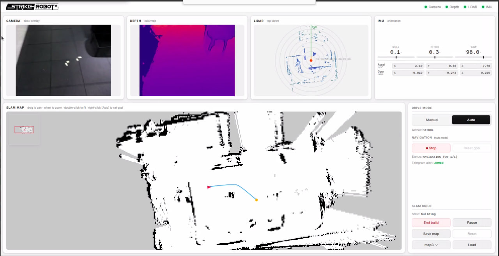

# G1 Patrol Demo — detecting objects dropped on the floor

A simulated demo of the Unitree **G1** robot patrolling a room (MuJoCo): the robot
is driven manually to build a map via **SLAM** from LiDAR, then switches to **Auto**
mode to patrol a set of predefined waypoints and scan the floor for objects left
lying around (cup / wrench / screwdriver). The RGB camera runs **YOLO26**
(ultralytics, COCO) drawing bounding boxes in realtime; when a target object is
detected, the system captures the frame and sends an alert with the image to
**Telegram**. A web dashboard displays all of them at once: the RGB camera (with
bbox), the depth map (HSV-encoded), the LiDAR scan, and the SLAM map with the
robot's position + path. The dashboard layout follows the reference design:



## Demo videos

**Build map (manual drive + SLAM):**

<video src="https://github.com/StrikeRobot/G1-Task-Conditioned-Mujoco/raw/main/buildmap.mp4" controls muted width="100%"></video>

**Auto navigation (click-to-goal + patrol):**

<video src="https://github.com/StrikeRobot/G1-Task-Conditioned-Mujoco/raw/main/navigation.mp4" controls muted width="100%"></video>

> If the players above don't load, download the clips directly:
> [buildmap.mp4](buildmap.mp4) · [navigation.mp4](navigation.mp4)

## Installation

```bash
pip install -r requirements.txt
```

Locomotion policy: the demo uses the 29-DOF velocity walker
`pretrain/loco/policy_29dof.pt` from
[G1_deploy](https://github.com/yifeichen2024/G1_deploy) (TorchScript). Place it at
`third_party/g1_loco/policy_29dof.pt` (see `configs/config.yaml` -> `policy.policy_path`):

```bash
mkdir -p third_party/g1_loco
curl -L https://raw.githubusercontent.com/yifeichen2024/G1_deploy/main/pretrain/loco/policy_29dof.pt \
  -o third_party/g1_loco/policy_29dof.pt
```

This checkpoint walks stably on the full 29-DOF body **and turns in place** (yaw
command works at zero forward speed, range ±1.57 rad/s). The obs layout (96-dim,
no history/phase) and PD gains/defaults are baked into `locomotion/policy.py`.

The MuJoCo scene in `scene/` is used as-is (loaded via `sim/loader.py`, with **no**
build step). The YOLO26 weights (`yolo26s.pt`) are downloaded automatically on the
first run. Note: YOLO26 uses the COCO vocabulary — only "cup" is in COCO, so it is
the only realistic target object; "wrench"/"screwdriver" are not in COCO (and the
scene has no meshes for those two objects either), so they are skipped, with a
warning logged at initialization.

## Setting up the Telegram bot

1. Open Telegram, message **@BotFather** -> send `/newbot` -> set a name & username
   for the bot -> BotFather returns a **TOKEN** (in the form `123456:ABC-DEF...`).
   Copy the token.
2. Send the **newly created bot** any message (e.g. "hi"). Then open in a browser:
   `https://api.telegram.org/bot<TOKEN>/getUpdates` — find `message.chat.id` in the
   JSON and copy that value (it is the **CHAT_ID**).
3. Create a `.env` file from `.env.example` and fill in the 2 values:

   ```
   TELEGRAM_BOT_TOKEN=123456:ABC-DEF...
   TELEGRAM_CHAT_ID=987654321
   ```

`.env` is gitignored. With both token + chat_id present -> **ARMED** mode (really
sends). Missing `.env` (or left blank) -> **MOCK** mode: detection images are only
saved to the `captures/` folder, not sent anywhere.

## Running the demo

```bash
MUJOCO_GL=egl python app.py
```

Open a browser: <http://localhost:8000>

## Demo flow

1. **Build map**: select **Manual** mode, press **SLAM Start**, use the
   `W`/`A`/`S`/`D` keys (and `Q`/`E`) to drive the robot around the room to build the
   occupancy map. Watch the SLAM map gradually fill in on the dashboard.
2. **Finish building the map**: press **End build** then **Save map** to save the map.
3. **Auto patrol**: switch to **Auto** mode then press **Patrol** (follows the
   waypoints in the config), or **right-click** directly on the map to set a goal
   point.
4. **Detection**: the robot scans the floor; when the camera sees a cup -> a bounding
   box appears on the RGB tile + a captured image is sent to Telegram (or saved to
   `captures/` if in MOCK mode).

## Controls

| Key | Effect |
|------|----------|
| `W` / `S` | forward / backward |
| `A` / `D` | turn (curve) left / right |
| `Q` / `E` | strafe left / right |

## Notes

- **The robot turns in place.** The `policy_29dof.pt` walker accepts a yaw command
  at zero forward speed (range ±1.57 rad/s), so A/D (or the ⟲/⟳ buttons) spin the
  robot on the spot; navigation rotates toward a goal before advancing. Forward speed
  tops out around `vx ~ 0.6`, strafe around `vy ~ 0.4`.
- **The realistic detection target is the CUP.** The scene only has a cup mesh on the
  floor (no wrench / screwdriver meshes), but the detector still prompts all 3 classes
  `["cup", "wrench", "screwdriver"]` for illustration.
- The default patrol waypoints (`nav.patrol_waypoints`) form a light loop from spawn
  `(-4.73, -0.22)` around the area with the cup `(-0.16, -3.83)`, avoiding the cabinet
  in the middle of the room.

## Testing

```bash
# Fast (skips the long sim + YOLO download):
MUJOCO_GL=egl pytest -m "not slow"

# Full (including end-to-end integration: sim ~11s + YOLO load):
MUJOCO_GL=egl pytest -m ""
```
